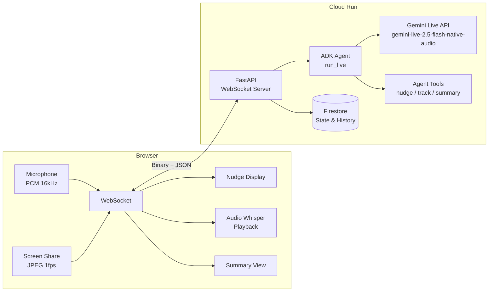

# Meeting Coach - AI Meeting Co-pilot

> Real-time meeting coaching agent powered by Gemini Live API. Your AI co-pilot listens to your meetings and provides actionable coaching nudges — then generates a comprehensive post-meeting summary.

**Built for the [Gemini Live Agent Challenge](https://googleai.devpost.com/) hackathon.**

## What It Does

Meeting Coach is a Live Agent that joins your meetings in real-time and helps you be a more effective communicator:

- **Participation Monitoring** — Nudges you when you haven't spoken in a while
- **Action Item Detection** — Automatically captures commitments and deadlines
- **Time Management** — Warns when meetings run long or topics drag on
- **Topic Tracking** — Tracks agenda coverage and detects off-topic drift
- **Key Decision Alerts** — Highlights important decisions that need confirmation
- **Post-Meeting Summary** — Generates a Markdown-exportable summary with action items and participation stats

## Architecture



## Tech Stack

| Technology | Usage |
|---|---|
| **Gemini Live API** | Real-time bidirectional audio/vision processing |
| **Google ADK** | Agent framework with `run_live()` streaming |
| **Google Cloud Run** | Backend hosting with WebSocket support |
| **Google Cloud Firestore** | Meeting state persistence and history |
| **FastAPI** | WebSocket server bridging client to ADK agent |
| **Vanilla JS** | Lightweight frontend with Web Audio API |

## Prerequisites

- Python 3.11+
- Google API Key ([get one here](https://aistudio.google.com/apikey))
- Google Cloud Project (for Firestore and deployment)
- `gcloud` CLI installed

### Prerequisites Check

```bash
# Verify Python version
python3 --version  # Should be 3.11+

# Verify gcloud CLI
gcloud --version

# Verify you're authenticated
gcloud auth list
```

## Local Development Setup

1. **Clone and install dependencies:**

```bash
git clone https://github.com/preetidave/meeting-coach.git
cd meeting-coach
pip install -r requirements.txt
```

2. **Configure environment:**

```bash
cp .env.example .env
# Edit .env and add your GOOGLE_API_KEY
# GOOGLE_CLOUD_PROJECT is optional for local dev (Firestore will gracefully degrade)
```

3. **Run locally:**

```bash
# Load environment variables
export $(cat .env | xargs)

# Start the server
uvicorn server.main:app --host 0.0.0.0 --port 8080 --reload
```

4. **Open in browser:**

Navigate to `http://localhost:8080`

## Deploying to Google Cloud Run

```bash
# Set required environment variables
export GOOGLE_CLOUD_PROJECT=your-project-id

# Run the deployment script
./deploy.sh
```

The script will:
- Check that required CLI tools and APIs are available
- Create a secret for the API key (if needed)
- Build and deploy the container to Cloud Run
- Configure timeout, session affinity, and resources
- Print the service URL

## Running Tests

```bash
pip install pytest httpx
pytest tests/ -v
```

## Project Structure

```
meeting-coach/
├── meeting_coach/          # ADK agent package
│   ├── agent.py            # Root agent definition
│   ├── prompts/            # System instructions
│   ├── tools/              # Agent tools (nudge, tracking, summary, agenda)
│   └── state/              # State management and Firestore sync
├── server/                 # FastAPI backend
│   ├── main.py             # WebSocket endpoint and ADK bridge
│   ├── models.py           # Pydantic message protocol models
│   └── session_manager.py  # Session lifecycle
├── frontend/               # Browser client
│   ├── index.html          # SPA with three views
│   ├── css/styles.css      # Dark theme UI
│   └── js/                 # Audio capture, screen share, nudge display
├── tests/                  # Test suite
├── Dockerfile              # Container image
├── deploy.sh               # Cloud Run deployment (IaC)
└── requirements.txt        # Python dependencies
```

## How to Use

1. **Setup** — Enter your name, set meeting duration, and optionally add agenda items
2. **Start Meeting** — Click "Start Meeting" to begin. Grant microphone access when prompted.
3. **During Meeting** — The coach listens silently and sends nudges to the right sidebar. Optionally share your screen for slide-aware coaching.
4. **End Meeting** — Click "End Meeting" to get a comprehensive summary with action items, participation stats, and coaching insights. Export as Markdown or copy to clipboard.

## Troubleshooting

| Issue | Solution |
|---|---|
| **Microphone not working** | Ensure the browser has microphone permission. Chrome requires HTTPS or `localhost`. |
| **WebSocket connection fails** | Check that the server is running on the correct port. Verify no firewall is blocking WebSocket connections. |
| **Firestore errors on local dev** | This is expected if `GOOGLE_CLOUD_PROJECT` is not set. State will not persist but the app works normally. |
| **Docker build fails** | Ensure Docker Desktop is running. Try `docker build --no-cache -t meeting-coach .` |
| **`deploy.sh` fails** | Run `gcloud auth login` and verify `GOOGLE_CLOUD_PROJECT` is set. Check that Cloud Run API is enabled. |
| **No audio from coach** | The agent responds via audio whispers. Ensure your browser volume is up and autoplay is not blocked. |

## Google Cloud Services Used

- **Cloud Run** — Serverless container hosting for the backend
- **Firestore** — NoSQL database for meeting state and summary persistence
- **Secret Manager** — Secure API key storage
- **Artifact Registry** — Container image storage

## License

This project is licensed under the Apache License 2.0 — see the [LICENSE](LICENSE) file for details.
